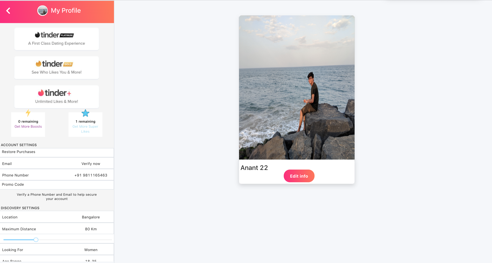

# Tinder Clone

  <h4>
In the project directory, tried to clone Tinder. User can sign up , and view other user's profile once the required credentials are entered.  
    </h4>
 

## sneak peek

## Languages and Tools:  

<code></code>
<code></code>
<code></code>
<code></code>
<code></code>
<code></code>

### Project Screenshots
- Landing Page

- User Profile

### Installation and Setup Instructions

Clone down this repository. You will need node and npm installed globally on your machine. Installation: npm install To Run Test Suite: npm test To Start Server: npm start To Visit App: localhost:3000/

### Tools Used
- React
- Ant Design

## Contributors
 <h3>Lakshmi</h3>👱‍
- gitHub@[lakshmi](https://github.com/lakshmi)
<h3>Anant Jain</h3>👨‍ 
- GitHub@[Anantjain226](https://github.com/Anantjain226) 
<h3>Lanka Sriniwas</h3> 👨‍ 
- gitHub@[lsriniwas](https://github.com/lsriniwas

### Acknowledgments

  We take all the responsiblity for every single line of code. The design inspire from Tinder.

